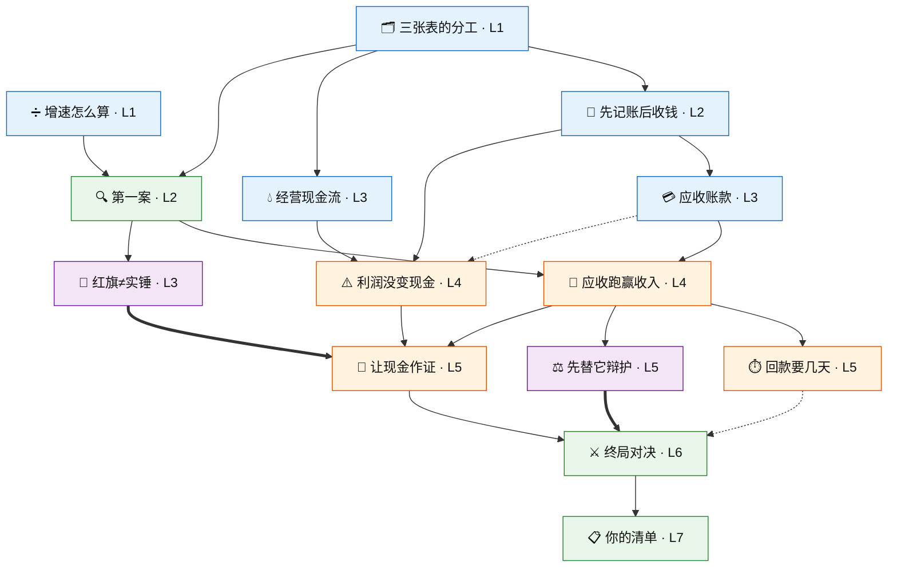

# 财报红旗 · 第一章「收入的水分」— 审图文档 v1
> **记录层**：知识图（节点与边）的审定记录，对应冻结版 `ch1-graph-v1`。不是规范，是留档。

> **性质**：§6 计划第 1 步产出，供人工审图（判断标准：节点该不该在 / 边方向 / 混淆对真不真）。
> **配套**：`site.json`（同目录，机器工件，schema 照抄 agent-graph-learning，扩展字段见其 `x_note`）。
> **日期**：2026-08-21 ｜ 审完改出 v2 后才进入第 2 步（填内容）。
> **审定记录（2026-08-22）**：§6 全部 8 项按「我的倾向」通过，零改动。图冻结为 **ch1-graph-v1**（冻结范围 = 节点/边/canon/evidence/混淆对语义；screens、pair id、复训题库为第 2 步内容字段，不在冻结范围）。进入开发前对齐：产品体验与用户流程 + 工程化规范，两份确认后才开发。

---

## 0. 一屏概览

**14 节点**（12–20 ✓）：基础规则 ×5，红旗识别 ×4，元能力 ×2，实战案例 ×3。
**20 边**：hard ×16（解锁门），soft ×2（相关加深），cross ×2（元能力）。
**两个 whole-task**：第一案（第 2 层，只需 2 个基础节点即解锁——满足 §3.2「早期」硬约束）+ 终局对决（第 6 层）。
**叙事弧**：第一案匿名给出 Sunbeam 的两行数字 → 学完工具后，终局实名揭示「你第一课就见过它」——案例先行（§3.3.5）与故事闭环一次做成。
**混淆对 8 对**，全部落在红旗与案例节点上（§3.6 一等公民）。
**清单**是最后一个节点，且教学内容本身就是「清单只用于复核」（§3.3.5）。

---

## 1. 图

图例：实线 = hard（解锁门）｜虚线 = soft（相关加深）｜粗线 = cross（元能力）。蓝 = 基础规则，橙 = 红旗识别，紫 = 元能力，绿 = 实战案例。

---

## 2. 节点表（14）

| # | id | 名 | 域 | 层 | 一句话 | canon 锚 | 题型（§3.2，第一章全规则判分） |
|---|---|---|---|---|---|---|---|
| 1 | `three-statements` | 三张表的分工 | 基础 | L1 源 | 三张表各管一摊，对不上就是线索 | Graham & Meredith 1937 | 点选/多选 |
| 2 | `growth-rate` | 增速怎么算 | 基础 | L1 源 | (今年−去年)÷去年；两科目增速对比 | CFA FSA 横向分析 | 点选/多选 |
| 3 | `accrual-basis` | 先记账后收钱 | 基础 | L2 | 权责发生制+收入确认（合并为一节点） | ASC 606 / IFRS 15 | 点选/多选 |
| 4 | `receivables` | 应收账款 | 基础 | L3 | 记了收入还没收到的钱 | Graham & Meredith | 点选/多选 |
| 5 | `ocf` | 经营现金流 | 基础 | L3 | 主业收进来的真金白银 | ASC 230 / IAS 7 | 点选/多选 |
| 6 | `case-first-look` | 第一案 | 案例 | L2 **whole-task** | 两行数字凭直觉判断一次，不计分 | AAER 1393（匿名引子） | 结论三选+信心标注 |
| 7 | `rf1` | 应收跑赢收入 | 红旗 | L4 | **红旗一**；「持续」才算 | Beneish 1999 DSRI + Schilit | 判断+理由多选+无法判断 |
| 8 | `rf2` | 利润没变现金 | 红旗 | L4 | **红旗二**；缺口去向科目是线索 | Sloan 1996 + Schilit | 判断+理由多选+无法判断 |
| 9 | `dso` | 回款要几天 | 红旗 | L5 | 红旗一的天数化等价算法 | Schilit + CFA 活动比率 | 判断+理由多选 |
| 10 | `corroborate` | 让现金作证 | 红旗 | L5 | 看见→假设→求证；双阳升级/一阳一阴降级 | Schilit 红旗组合 | 判断+理由多选 |
| 11 | `base-rate` | 红旗≠实锤 | 元能力 | L3 **cross** | 舞弊基率约 10%（Dyck，§3.6 已裁决）；自然频数 | DMZ 2023 + S&G 2001 | 多选+频数填空 |
| 12 | `falsification` | 先替它辩护 | 元能力 | L5 **cross** | 竞争假设分析；排除不掉→无法判断 | Heuer 1999（公有领域） | 判断+理由多选 |
| 13 | `case-final` | 终局对决 | 案例 | L6 **whole-task** | Sunbeam 实名 L2 三表 vs 无辜对照，整案判别 | AAER 1393 + FY1997 10-K | 结论三选+证据多选+信心 |
| 14 | `checklist-after` | 你的清单 | 案例 | L7 | 清单后置：先判断，再复核（§3.3.5） | Schilit 侦测要点 | 整理/排序 |

对照 §4 硬性要求：源节点=基础规则 ✓（应收账款/三大表/增速全在）；红旗 1、红旗 2 ✓；≥1 whole-task 且早期 ✓（2 个，首个在 L2）；cross 元能力 1–2 个、基率优先 ✓；语料 = AAER + 公开财报 ✓；呈现 L1 为主 + 个别 L2 ✓（仅终局是 L2）。

---

## 3. 边表与理由（审方向用）

### hard（16 条，解锁门）

| from → to | 为什么是前置 |
|---|---|
| 三张表 → 先记账后收钱 | 先知道有哪几张表，才谈得上「利润表和现金流量表为什么不同」 |
| 三张表 → 经营现金流 | 现金流量表的位置与三段分类 |
| 三张表 → 第一案 | 第一案只要求「知道数字是什么」+「会算增速」，门槛刻意压到最低 |
| 增速 → 第一案 | 同上 |
| 先记账后收钱 → 应收账款 | 应收 = 权责发生制的直接产物（记了收入没收到钱的存放处） |
| 先记账后收钱 → 红旗二 | 理解背离机制的前提：利润与现金天然有时间差 |
| 应收账款 → 红旗一 | 科目本身是信号的载体 |
| 第一案 → 红旗一 | **案例先行的结构化落点**：先直觉判断过，再学正式工具（Bierstaker，§3.3.5） |
| 第一案 → 红旗≠实锤 | 你刚做过一次判断，现在告诉你底率——时机最佳 |
| 经营现金流 → 红旗二 | 科目载体 |
| 红旗一 → 回款要几天 | DSO 是红旗一的精细化，不先懂增速对比无从谈等价性 |
| 红旗一 → 先替它辩护 | 无辜解释训练挂在第一面红旗后，立刻可用 |
| 红旗一 → 让现金作证 | 印证流程的起点是「看见」 |
| 红旗二 → 让现金作证 | 印证流程的工具是红旗二 |
| 让现金作证 → 终局对决 | 终局要求完整的看见→求证链 |
| 终局对决 → 你的清单 | 清单必须出现在案例之后（§3.3.5 不可协商） |

### soft（2 条）

| from → to | 语义 |
|---|---|
| 应收账款 → 红旗二 | 应收是 NI−OCF 缺口最常见的去向——学过更好，不强制 |
| 回款要几天 → 终局对决 | 终局材料含 DSO 行，会算更从容，不会也能解 |

### cross（2 条，元能力，§3.1）

| from → to | 语义 |
|---|---|
| 红旗≠实锤 → 让现金作证 | **印证的动机来自基率**：正因为单红旗多半无辜，才必须求证 |
| 先替它辩护 → 终局对决 | 整案判别的第一步就是替双方找无辜解释 |

Validator 自查（对照 agent-graph-learning 规则）：无环 ✓；hard 边层深单调 ✓；无传递冗余（hard 闭包逐条查过，如 `growth-rate→rf1` 已因 `growth-rate→case-first-look→rf1` 而省去）✓；根节点 = 三张表、增速两个 ✓；canon.source 全部指向 sources 数组 ✓。`screens` 全空是有意的——那是第 2 步。

---

## 4. 混淆对清单（8 对，§3.6 一等公民）

干净样本不随机抽，就是每对的 b 面。

| 节点 | 表象（look） | a：红旗解读 | b：无辜解读 | 区分线索（key） |
|---|---|---|---|---|
| 第一案 | 收入应收都在涨 | A 公司：收入+16%、应收+59%（Sunbeam 前三季简化） | B 公司：收入+30%、应收+33%，步调一致 | 不看谁涨得猛，看两条腿步子是否一致 |
| 红旗一 ① | 应收连续两年跑赢收入 | 激进/提前确认收入（Sunbeam 型） | 大客户集中+账期延长 | 客户集中度与账期披露；现金流是否同步恶化 |
| 红旗一 ② | 应收/收入比跳升 | 渠道塞货 | 商业模式转赊销/分期（一次性台阶） | 造假逐季爬升 vs 模式切换一次跳变 |
| 红旗一 ③ | 应收+80% 远超收入+20% | 虚构收入挂应收 | 并购并表基数不可比 | 并购公告与 pro forma 口径，剔除后重算 |
| 红旗二 ① | 净利正、经营现金流连续负 | 纸面利润（挂应收收不回） | 高速扩张期营运资本吞现金 | 缺口去向：应收（可疑）vs 存货/预付（备货） |
| 红旗二 ② | 单年 OCF 大幅低于净利 | 操纵苗头 | 大单回款跨期/季节性，次年回正 | 拉长三年看趋势；一次是问号，持续才是红旗 |
| DSO | DSO 60→85 天 | 回款恶化/激进确认 | 客户结构转向大企业/对公 | 纵比自己+横比同行；跨行业无意义 |
| 让现金作证 | 红旗一阳性 | 双阳 → 升级深查 | 一阳一阴 → 无辜概率大增 | 印证=看两信号是否指向同一机制，不是凑数 |
| 终局对决 | 两家应收都激增 | Sunbeam：双阳+期末突击发货 | 对照公司：账期/季节解释成立、现金流无恙 | 先替双方辩护，看谁的无辜解释被现金流量表否决 |

（终局的 b 面公司第 2 步选定实名案，候选方向：年付制企业软件商的 Q4 应收季节性——**未验证，属第 2 步取数时的核实项**。）

---

## 5. 事实核查状态

| 事实 | 状态 |
|---|---|
| Sunbeam = SEC AAER No. 1393 / LR-17001（2001-05-15），指控含 channel stuffing、bill-and-hold、cookie jar | ✅ 本轮 WebSearch 验证（sec.gov） |
| 1997 全年净利润 ≈ $109.4M、经营现金流为负（约 −$60.8M） | ✅ 方向验证（10-K 数据 + 教学案例引用 Schilit）；精确值第 2 步从 EDGAR 原档核定 |
| 前三季收入 +16% vs 应收 +59%（Schilit 口径） | ✅ 方向验证；第 2 步以 10-K/10-Q 原档重算后为准 |
| 舞弊基率约 10%（Dyck–Morse–Zingales） | v3 §3.6 已裁决，不重开 |
| 终局对照公司（无辜应收激增实名案） | ⬜ 未定未验证——第 2 步选定并从原档取数 |

---

## 6. 待裁决问题 → 已全部裁决 ✅（2026-08-22，8/8 按倾向通过，原文留档）

1. **首案→终局的叙事弧**：第一案匿名用 Sunbeam 真数字，终局实名揭示「你第一课就见过它」。代价是终局对 Sunbeam 的「新鲜感」减半——判别难度主要落在对照公司身上。**我的倾向：保留**（故事闭环+复用一套已核数字，且终局考的是判别不是识旧）。备选：首案改用虚构面板或另一实名案。
2. **`dso` 节点去留**：Schilit 正典工具、红旗一的等价精细化；但第一章以 L1 面板为主，DSO 是唯一要做除法的节点。砍掉则 14→13，图更轻。**我的倾向：保留**，soft 通向终局（材料可用可不用）。
3. **「判断+一句话理由」的第一章形态**：§2.6 规则判分 ⇒ 我按「判断规则判分 + 理由做成多选（你的主要依据是？）+ 自由文本框选填仅存档」设计。自由文本第一章完全不判分，只进错题档案供复盘。请确认。
4. **`accrual-basis` 合并了收入确认**：权责发生制与收入确认合为一节点（红旗一的归因链只需要「先记账后收钱」这一个概念）。拆开会多一个节点但每个更薄。**我的倾向：合并**。
5. **元能力第二席给了证伪（ACH）而非「相关 vs 因果」**：理由是混淆对训练的直接理论支撑就是竞争假设 + Heuer 是公有领域正典（与 AAER 同档）。相关 vs 因果留给第二章（现金流章更需要它）。
6. **`checklist-after` 作为节点**（而非产品功能页）：§3.3.5 的「清单后置」需要被显式教一次，否则用户自己会把清单当初判工具。**我的倾向：保留节点**。
7. **`ageStart` 重用为层深**：validator 的单调性检查借此继续有效，UI 显示「第 N 层」。若将来模板硬编码「岁」字样，POC 阶段改模板文案。
8. **元能力节点带一条 hard 入边**（`case-first-look→base-rate`、`rf1→falsification`）：§3.1 只说 cross 边连元能力节点，未禁止 hard 入边——不加则它们成为开局即解锁的孤根，时机全错。我按「hard 定解锁时机 + cross 表达跨域贡献」处理。请确认这不违反你对 §3.1 的本意。

---

## 7. 第 2 步预告（审图通过后）

每节点 3–5 屏 + 题（混淆对题 + 「无法判断」选项全覆盖）；L1 面板组件；Sunbeam 数字从 EDGAR 原档核定；终局对照公司选定实名案并取数；难度锚 85% 答对率（§3.5）留给第 3 步组站后用试用数据校。
